## Mocking in jUnit

**Important Note:** Mocking is available only for the test cases created using stored procedures/ UDF from the iUnit repository and objects from an existing iUnit repository.

The ARCAD iUnit project enables mock functionality in test cases, which is particularly useful when dealing with dependencies on other objects, interactions with databases, or calls to external programs. This feature allows for simulating the behavior of real objects within an isolated testing environment.

### Mocking View

In the Mocking view, you can:

1. **Simulate Object Behavior:** Test modifications in an isolated environment by simulating the behavior of real objects.
2. **Isolate Dependencies:** Ensure that objects interact as expected without reliance on external systems.
3. **Enhance Test Reliability:** Improve the reliability of test cases by controlling the behavior of dependent objects.

### Mock Database File Dependencies

1. **Access Mocking via Context Menu**:

   - Right-click on the desired test case to mock.
   - Select `iUnit` > `TestCase` > `Mock Test Case` from the context menu.
   - You will be presented with all available mocking options with database files, programs, and procedure dependencies drop-down lists.
   - Click on the `Mock Database Files`.

2. **Select Database File**:

   - Choose a database file from the available list of Files to Mock.  
     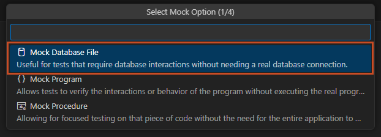

3. **Configure Mocking**:

   - Click the File you want to Mock.  
     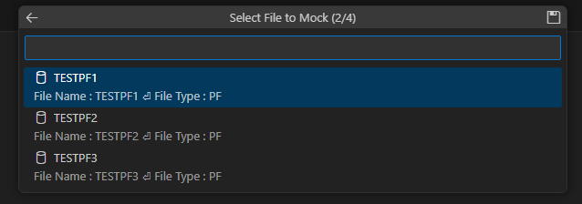
   - Enter values in Step 2 of the Database Mocking Commands List.
   - Click OK to confirm.  
     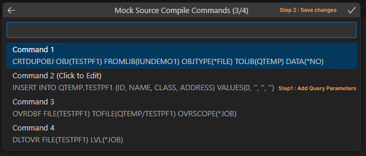

4. **Save Changes**:

   - Save the changes (by clicking the save icon).  
     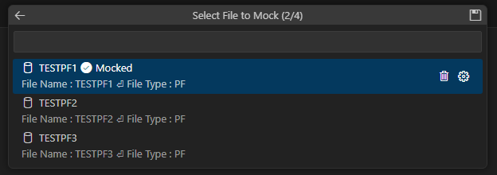

5. **Result**:
   - The process creates test case(s) with mocking ability and adds the following elements:
     - One XML file in the `MockTestCases` folder.
     - One Java class for the mock test case within the specified package in the `src` folder.

To delete a mocked database file dependency, click on Delete Icoon right next to the file name.

### Mock Program Dependencies

Follow these steps to mock program dependencies in the ARCAD iUnit project:

1. **Access Mocking via Context Menu**:
   - Right-click on the desired test case to mock.
   - Select `iUnit` > `TestCase` > `Mock Test Case` from the context menu.
   - You will be presented with all available mocking options with database files, programs, and procedure dependencies drop-down lists.

- click on the `Mock Programs`.  
  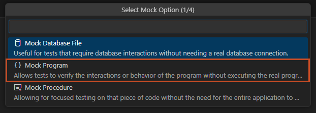

2. **Select Program Dependency**:
   Choose a program from the Program Dependencies list.  
   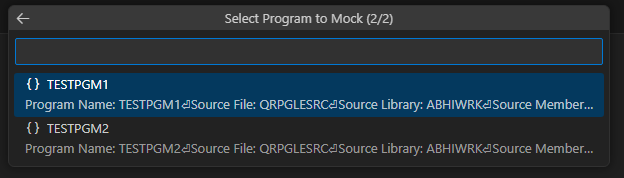

3. **Modify Source Code (Optional)**: 
   - Source Code is displayed in the VS Code editor.
   - Modify the source code in the VS Code editor if necessary.    
     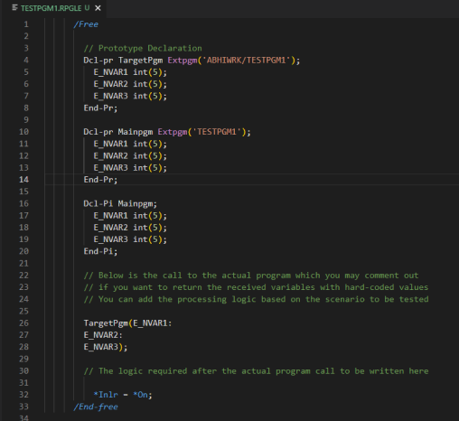

4. **Result**:
   - The process creates test case(s) with mocking ability and adds the following elements:
     - One XML file in the `MockTestCases` folder.
     - One Java class for the mock test case within the specified package in the `src` folder.

To delete a mocked program dependency, select the program and click the Delete icon.

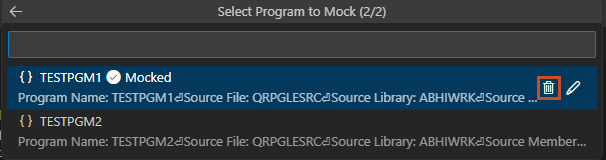

### Mock Procedure Dependencies

**Important Note:** Procedure mocking is disabled when variables are traced for a procedure, and vice versa.

#### Follow these steps to mock procedure dependencies:

1. **Access Mocking via Context Menu**:

   - Right-click on the desired test case to mock.
   - Select `iUnit` > `TestCase` > `Mock Test Case` from the context menu.
   - You will be presented with all available mocking options with database files, programs, and procedure dependencies drop-down lists.
   - Click on the `Mock Procedures`.  
     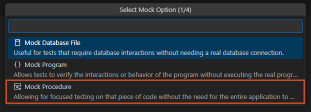

2. **Select Procedure Dependency**:

   - Choose a procedure to mock from the Procedure Dependencies list.    
     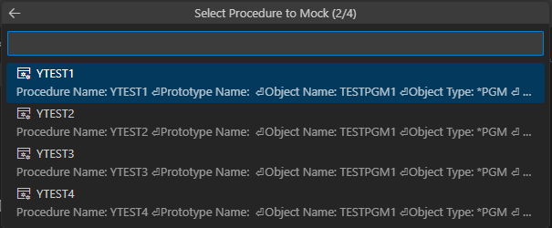

3. **Save Changes**:

   - Save the changes (by clicking the save icon).

4. **Modify Source Code (Optional)**:
   - Source Code is displayed in the VS Code editor.
   - Modify the source code in the VS Code editor if necessary.    
       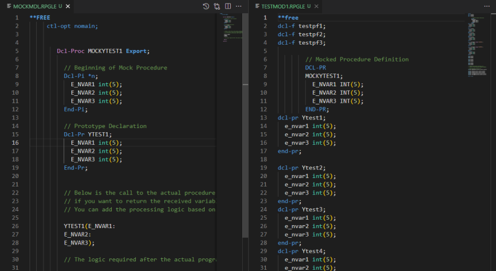

#### Result:

- The process creates test case(s) with mocking ability and adds the following elements:
  - One XML file in the `MockTestCases` folder.
  - One Java class for the mock test case within the specified package in the `src` folder.

> **Note**  
> All mocked procedures will be deleted if you delete a mocked procedure.

To delete a mocked procedure dependency, click the Delete icon right next to the Procedure Name.
