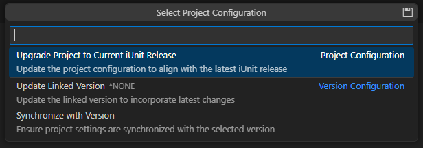

### Update jUnit Project Configuration

Once the ARCAD-iUnit project has been successfully created, it can be changed in many aspects : Project configuration, Connection Configuration, and Code Coverage configuration.

Follow the subsequent steps to update project configuration.

#### Steps

1. **Access Project Configuration**:

   - Right-click on the Test Case in the **Test Runner** viewer.
   - Select `iUnit` > `Update Project Configuration` from the context menu.

   

2. **Update Project Configuration**:

   - The `Project Configuration` QuickPick Window will Open.
   - Click on the required item to use/ update the properties..
   - Click the **Save** button to save the changes.

     <!-- note -->

     > **Note**:
     > **Project configuration** : This option upgrades the iUnit project to the current iUnit version installed.  
     > **Update Linked Verison** : This option updates the linked version of the iUnit project to the current version of the iUnit Version Repository.  
     > **Synchronize Project** : This option synchronizes the iUnit project with the iUnit Repository.

   

3. **Result**:

   The project configuration is updated successfully.
