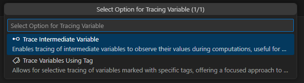
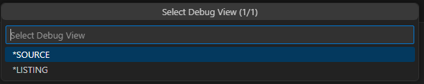
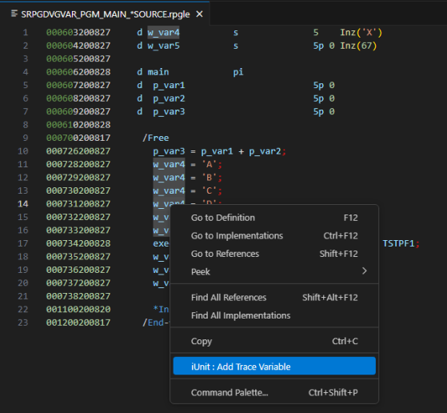
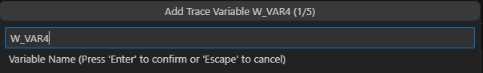
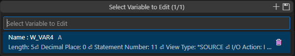
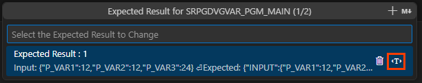
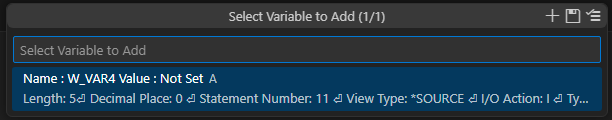
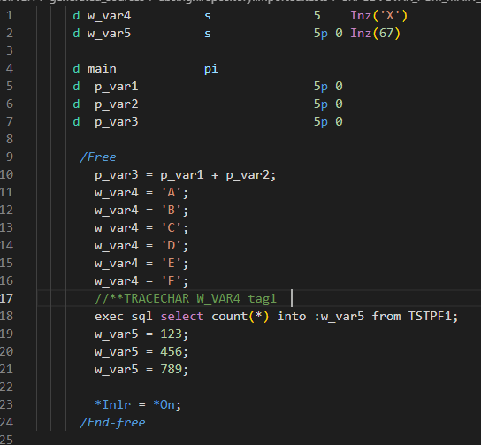

# Variable Tracing in JUnit

The ARCAD-iUnit project allows you to trace variables in a test case. The variable tracing can be done either by tracing intermediate variables or by tracing variables using tags. However, only one of them can be used at a time.

> **Note:**
>
> - Variable tracing is disabled when procedures are mocked, and vice versa.
> - The Trace variable feature is available only for RPG/RPGLE/SQLRPG/SQLRPGLE object types.
> - The Test Case Expected Result window shows the option to modify the value of the specific trace variable only when trace intermediate variables are defined.

### Trace Intermediate Variables

#### Access Variable Tracing via Context Menu

1. Right-click on the desired test case to trace variables.
2. Select `iUnit` > `TestCase` > `Trace Variables` from the context menu. The list of all available tracing options is displayed, with intermediate variables via and tags drop-down lists.
3. Click on the `Trace Intermediate Variables` option.

   

#### Add Intermediate Variables

1. Select the `Trace Variables` option from the list.
2. In the `Select Debug View` dialog, choose a view type (_Source_ or _Listing_).

   

3. In the source editor window, right-click on the variable you want to add and select `iUnit: Add Trace Variable`. The `Variable Definition` QuickPick Window will pre-populate the fields for a correct variable.

   

4. Define `I/O Action` and `Duplicate Action` from the QuickPick window.

   

5. After defining all attributes, the selected variable will be added to the `Trace Variables` list.

   

6. To edit a variable, select it and click `Delete Variable` to remove it.
7. To add a value to the variable, click `Add Expected Result`. A list of expected results will appear. Click the `Add Variable` icon next to the expected result to add the value.

   

   This will display a list of Trace Variables for which you can set the value.

   

8. Once the value is set, click the `Save` button to save the changes. To trace the intermediate variables, add expected results and run the test case via JUnit.

**Result:** The intermediate variables are added and traced.

### Trace Variables Using Tags

#### Access Variable Tracing via Context Menu

1. Right-click on the desired test case to trace variables.
2. Select `iUnit` > `TestCase` > `Trace Variables` from the context menu. The list of all available tracing options is displayed, with intermediate variables via tagging from the list.
3. Click on the `Trace Variables Using Tags` option.

   

#### Add Tags

1. In the source editor window, add the tag for the variable(s) to trace. Add the tag just below the statement where the variable(s) value has to be traced. The tag should be in the following format:

   ```
   //**TRACECHAR VARIABLENAME LABELNAME
   //**TRACENUM VARIABLENAME LABELNAME
   //**TRACEOTH VARIABLENAME LABELNAME
   ```

2. Press `Ctrl + S` to save the changes. The tags will be added to the source code and variables will be added to the `Trace Variables` list.

   

3. To add a value to the variable, click `Add Expected Result`. A list of expected results will appear. Click the `Add Variable` icon next to the expected result to add the value.

   This will display a list of Trace Variables for which you can set the value.

4. Once the value is set, click the `Save` button to save the changes. To trace the variables using tags, add expected results and run the test case via JUnit.

**Result:** The variables are traced using tags.
