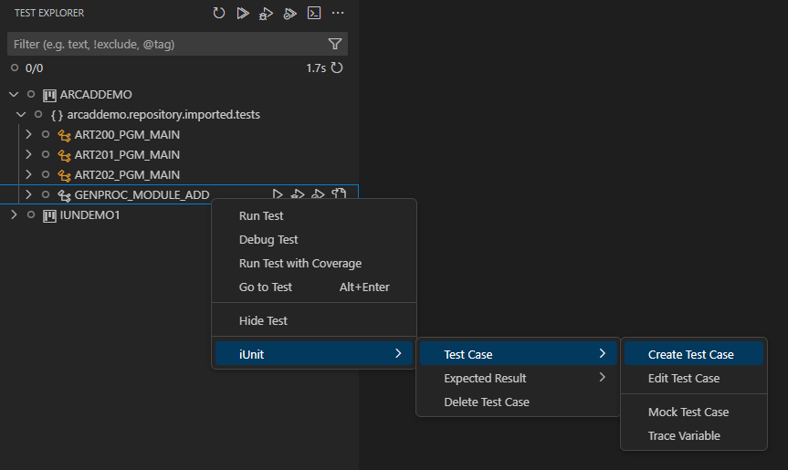
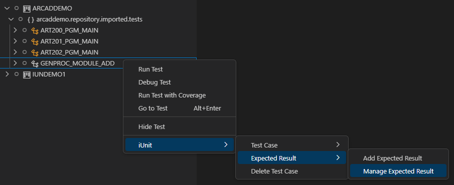
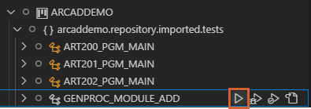
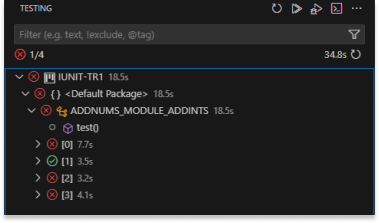

# Setting up the JUnit testing environment

In order to execute unit-tests on your applications via JUnit, you must first set up the testing environment. Setting up the environment includes creating projects and managing repositories and versions.

ARCAD iUnit projects are used to create and run unit test cases via JUnit.

  
_Working with JUnit_

## Prerequisites
Before you start, it is necessary to habve prior knowledge of JUnit testing methods and technical vocabulary. This documentation does not cover JUnit technology.

> **Reference**  
For more information about JUnit, refer to the [documentation](https://help-arcad-iunit.arcadsoftware.com/Topics/JUnit/JUnit-Intro.htm).

Make sure that the [Extension Pack for Java](https://marketplace.visualstudio.com/items?itemName=vscjava.vscode-java-pack) is installed in your Visual Studio Code IDE to use the JUnit testing features.

  
_Extension Pack for Java_

## Importing the ARCAD iUnit project

> **Note:**  
To run the JUnit-iUnit project, you have to manually import the ARCAD iUnit project to the Workspace.

To import the ARCAD iUnit project in the Workspace, right-click on the repository and click the **Export to ARCAD iUnit Project** option from the ARCAD iUnit Extension.  
The ARCAD iUnit project is then created with the same name as the repository and added to the current Workspace in the Visial Studio Code IDE.

The JUnit extension detects automatically the ARCAD iUnit project and displayd the test cases in the **Test Explorer** view.  
You can execute the test cases directly from the **Test Explorer** view and the test results are shown in the **Test Results** window.

## Creating the Test Case in jUnit

> **Note**  
You can have access to the Arcad iUnit menu only when you are connected to the AFS server using the Arcad iUnit extension.  
If that is not the case, use the ` ctrl+shift+p `  command, enter **Connect to AFS Server** and continue with the next steps to connect.

In the JUnit mode, you can create a new JUnit Test Case by right-clicking on the Test Explorer and selecting the **Create Test Case** option.

  
_Create Test Case_

## Adding Expected Result to the Test Case

The Expected Result can be added to the Test Case by right-clicking on the Test Case and selecting the **Add Expected Result** option.

  
_Add expected result_

It is also possible to add multiple Expected Results to the Test Case by right-clicking on the Test Case and selecting the **Add Expected Result** option.

## Managing Multiple Expected Results

You can manage multiple Expected Results by right-clicking on the Test Case and selecting the **Manage Expected Results** option.  
A new window isdisplayed with the list of Expected Results and you can choose one to modify the Expected Result.

  
_Manage Expected Result_

## Executing the Test Case

The Test Cases in JUnit Mode can be executed by clicking the **Execute Test Case** icon in the Test Case in the Test Explorer view.  
You can also exeecute multiple Test Cases by executing the package of Test Cases or the entire project.

  
_Execute Test Cases_

## View the Test Results

The statuses of the Test Cases can be viewed on the Test Explorer. A green icon indicates a successfully executed Test Case, whereas the red icon signifies a failed one.

  
_Test Cases results_

The results can be viewed in the **Test Results** view. You can open the Test Results view by clicking the **Test Results** icon in the Status bar.

<!-- image doesn't exist in media folder : -->

## View the Code Coverage

The Code Coverage of the Test Case can be viewed on the Debug Console.

  
_Code Coverage view_

