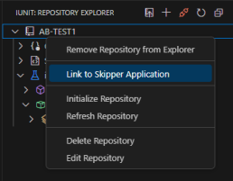

### Application Provider Mode

The Application Provider mode is used to create and manage Test Cases and Test Suites. It is also used to run Test Cases and Test Suites.

## Link Application to Repository

1. Right click on the Repository you want to link the Application to.

    
2. Click on the Link Application option from the Context Menu.
3. A window will pop up to select the SCM Provider.

    
4. Select the SCM Provider and Click Enter.
5. A window will pop up to select the Application.

    

6. Select the Application and Click Enter.
7. The Application will be linked to the Repository.
   
   Note : Linking the Application to Repository will clear all the Libraries and Add the Application Library to Repository and re-initialize the Repository.

