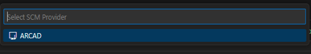
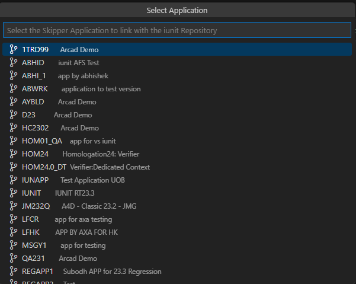
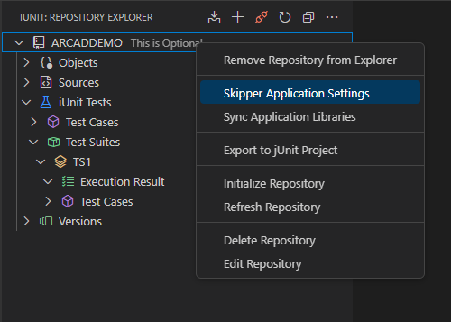
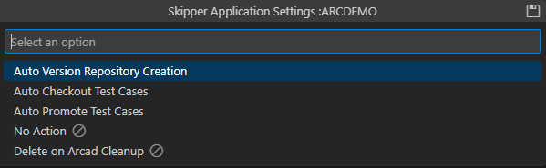
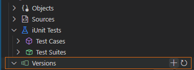
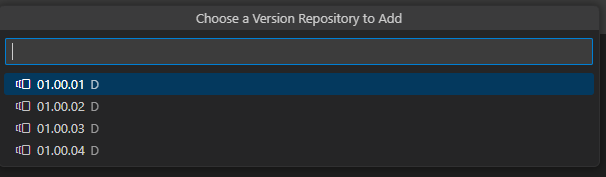
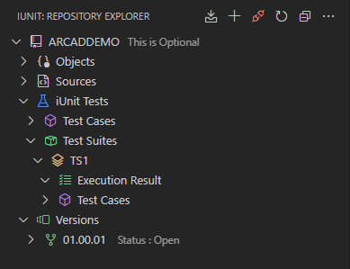
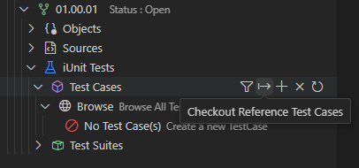
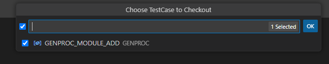

# Application Provider Mode

The Application Provider mode is used to create, manage and run Test Cases and Test Suites. To do so, the Application Provider mode has to be linked to the Repository.

The way we have iUnit integrated with ARCAD via the Application Provider mode is also available in the Visual Studio Code version.  
When the iUnit repository is linked with an ARCAD version, it should display the **Versions** node and if a specific version has child versions (it is the case of a node version), the **Versions** node should be displayed too.

The automatic actions settings as it is in RDi mode, should be active in Visual Studio Code too.

## Link the Application to the Repository

Follow the subsequent steps to link the Application to the Repository.

**Step 1** &nbsp; Right-click on the Repository you want to link to the Application to open the context menu.

**Step 2** &nbsp; Select the **Link Application** option from the Context Menu.

**Step 3** &nbsp; A new window opens to let you select the **SCM Provider**.

**Step 4** &nbsp; Select the SCM Provider and press **Enter**.

**Step 5** &nbsp; A new window opens to let you select the **Application**.

**Step 6** &nbsp; Select the Application and press **Enter**.

**Result** &nbsp; The Application is successfully linked to the Repository.

> **Note**  
> Linking the Application to the Repository clears all the Libraries. It also adds the application library to the Repository and re-initializes the Repository.

## Update Skipper Application Settings

Follow the subsequent steps to update the Skipper Application settings.

**Step 1** &nbsp; Right-click on the Repository you want to update the settings for.

**Step 2** &nbsp; Select the **Skipper Application Settings** option from the Context Menu.

**Step 3** &nbsp; A new window opens to let you update the Skipper Application settings for Automation.

**Step 4** &nbsp; Update the Skipper Application settings by clicking the Save Icon on the window **Enter**.

## Viewing Linked Versions in the Repository

> __Note__  
> Once the Repository is linked to the Version, an extra node labeled 'Versions' will appear in the tree view. This node will contain all the linked versions. If a version has child versions, the Version Repository Node will be displayed under the version node. 

### Adding Version Repository Manually

If the **Auto Version Repository Creation** setting is not selected in the Skipper application, or if a version has already been created in skipper, follow these steps to manually add a version repository in iunit:

**Step 1** &nbsp; Click on the icon of 'Add Version'. This will display a list of available version repositories.
 
 
  
**Step 2** &nbsp; Select the version repository you want to add and click on the 'Add' button.

**Step 3** &nbsp; The version repository will be added to the repository.

### Checkout Test Case in Version Repository

To checkout a Test Case in the Version Repository, follow these steps:

**Step 1** &nbsp; Click on the Test Case checkout icon given on the Test Cases Node.

**Step 2** &nbsp; Choose Test Case to checkout and click on the 'Ok' button.

**Result** &nbsp; The Test Case is successfully checked out in the Version Repository.

> __Note__
> To Successfully checkout a Test Case, the Test Case Object must be checked out in the Version Repository and compiled.

  

