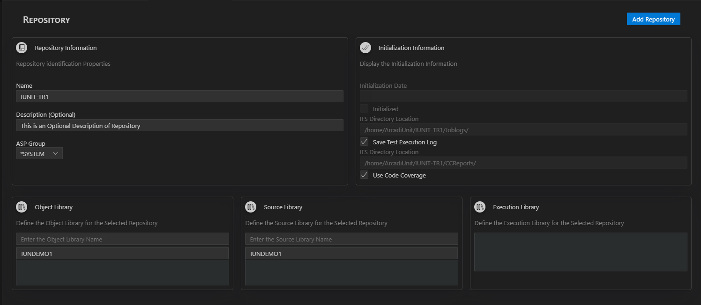
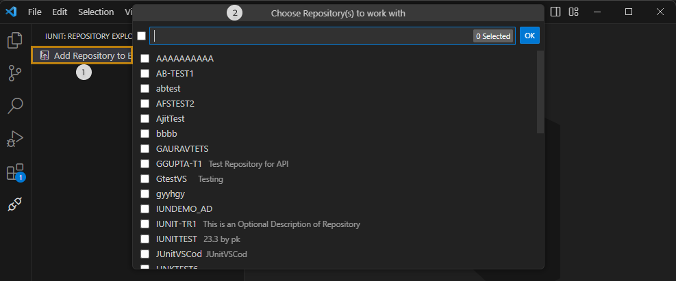

# Repositories
## Creating new repository
**Step 1** &nbsp; Click on the **(+)** icon on the **Repository Explorer** to open the Repository creation page.

**Step 2** &nbsp; Set the new Repository's properties:  
> * Set the name of the Repository,  
> * _[Optional]_ Enter a description of this new Repository,  
> * Set the new Repository's ASP Group,  
> * Add libraries to the Repository.  
    

_Creating a new Repository_

**Step 2** &nbsp; Click the **Add Repository** button.  

**Result** &nbsp; The Repository is successfully created and auto-initialized. The new Repository is then displayed in the repository list in the **ARCAD iUnit Explorer** view.

## Editing a repository
You can edit the properties of any created Repository later on, such as Libraries, Execution Log or Code Coverage (if not set while creating the Repository).

To do so, right-click on the **Repository** node from the **ARCAD iUnit Explorer** view to open the Repository in Edit Mode ans make changes.

## Initializing repositories
Initializing a repository allows you to load all the objects and sources from the libraries defined in the repository.

When you create a new Repository, it is auto-initialized. However, when you add a new Library to an existing Repository, it requires the re-initialization of the Library.

To do so, right-click on the Repository to initialize, then click on **Initialize** option.

  
_Initialize a  Repository_

## Adding Repositories to the Explorer
If you previously added Repositories with the same configuration, they are be automatically loaded into the AFS Extension.

If that is not the case, you have to manually add the Repositories to the Explorer.

_Adding a  Repository to the Explorer_

Follow the subsequent steps to add a Repository to the Explorer.

**Step 1** &nbsp; Click on the**Add Repository to Explorer** button in the iUnit Extension panel to display the Repositories of the connected Server.

**Step 2** &nbsp; Select the Repository you want to work with to ass them to the Explorer.

**Result** &nbsp; The selected Repositories succesffully added to the iUnit Repository Explorer, allowing you to access and manage its Test Cases, Test Suites and other functionalities.