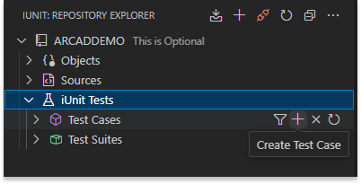
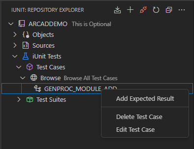
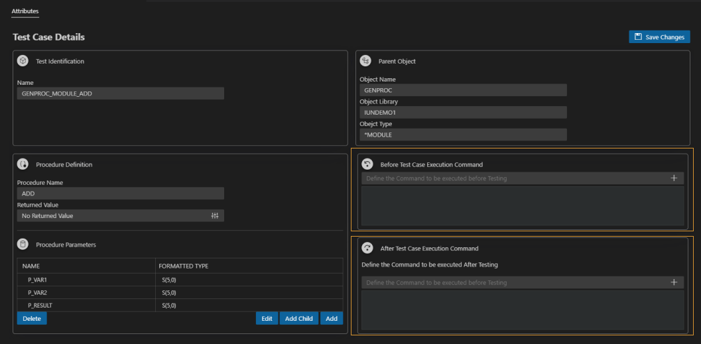
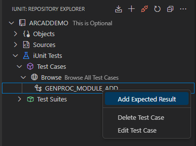
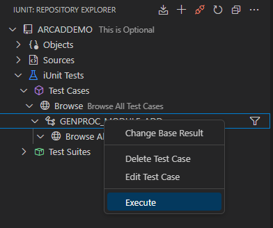
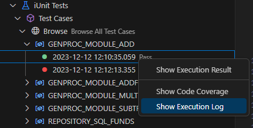
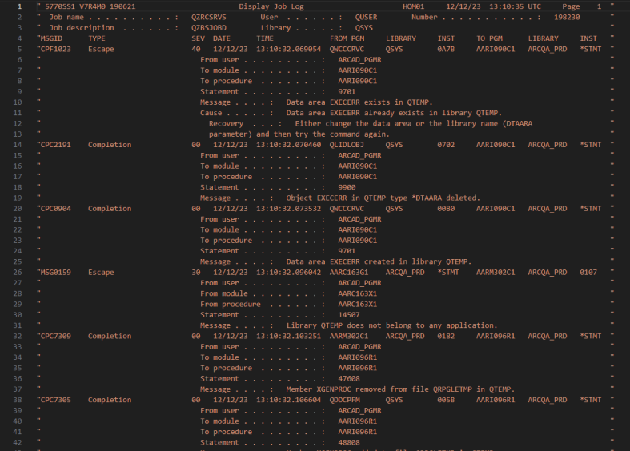

# Test cases

## Creating a new Test Case

ARCAD iUnit simplifies the creation of test cases by retrieving all the procedures and parameters of the parent object targeted by the test case.

The test cases can be created manually or by using an existing object from the iUnit repository. 

The **manual** option is used for below cases:
1. The new objects which are still under development and they doesn't exist yet 
2. The objects for which the source type is not supported by iUnit parser e.g. C 
3. Those objects which do not have sources and therefore iUnit source parser can't identify parameters

Follow the subsequent steps to create a new Test Case.

**Step 1**   In the **Test Cases** Node, click the **(+)** Add Test Case icon.

  
_Add a Test Case_

**Step 2**   Click the **Select Object from Existing iUnit Repository** option.  

Click **Next >** to continue.

**Step 3**   Select the object from the list of objects loaded from repository.  
The name of the Test Case is automatically generated based on the selected object and procedure, but you can edit to set a more descriptive/meaningful name for the procedure being tested.

> **Note**  
The **Skip Source Parsing** allows you to skip the Parsing of Selected Procedure Source member. This option is useful for performance to avoid source parsing when the source member is quite large and hasn't been modified since last time when a test was created on this object. When the first test is created on an object, the source member is parsed and stored in the repository irrespective of **Skip Source Parsing** selection. 

Press  **Enter** to continue.

**Result**   The new Test Case is successfully created and displayed in the Explorer.

## Editing Test Cases
To edit a test case, right-click on the test case and select the **Edit** option.

  
_Edit a Test Case_

### Adding Before/After Test Case Execution Command  

  
_Add a command_
<!-- please retake this screenshot as it is not possible to read it-->

Follow the subsequent steps to add a command to execute before or after the test case execution.

**Step 1**   Enter the IBMi command to execute. 
> **Example**  
`DLTDTAARA DTAARA(QTEMP/TEST)`

**Step 2**   Click the **Add** button to add the command to the list.

**Result**   The command is successfully added.

### Adding Input/Output Parameters

For addding parameters to a test case, click the **Add** button to open the **Procedure Parameter Definition** dialog and add the input/output parameters. This is generally required only when the test case is being created using **manual** option or any parameter changes have been made to a procedure interface and the pre-existing test case on that procedure is to be updated to reflect modified parameters.

  
_Add Input/output parameters_
<!-- please retake this screenshot as it is not possible to read it-->

Follow the subsequent steps to add a parameters to a test case.

**Step 1**   Set the parameter's name, data type and value.  

**Step 2**   Click the **Add** button to add the parameter to the list.  

**Result**   The parameter is successfully added.

> **Note**  
Click the **Delete** button to remove the parameter, or the **Edit** button to apply changes to the parameters.
   
## Creating Expected Results

Follow the subsequent steps to create an expected result.

**Step 1**   Right-click on the Test Case you want to create the expected result for.

**Step 2**   Click on the **Create Expected Result** button.

  
_Add Expected Result_

A new window opens to let you create the expected result.

_Expected result creation view_

**Step 3**   Enter the Expected Parameter Values, then click the **Add** button to confirm.

> **Note**  
If the **Do not execute** checkbox is ticked, the test case is not executed.  
If the **Output same as input** checkbox is ticked, the output parameter is the same as the input parameter.

**Step 4**   Click on the **Save** button to save the expected result. 

**Result**   The expected result is successfully added. The test case is executed and its result is displayed.
   
  
_Test Case Result_

## Editing Expected Result
When working with a Test Case, expected results may need to be modified. You can use this option to access the expected result again.

Follow the subsequent steps to change the expected result of a test case. 

**Step 1**   Right-click on a test case and click the **Change Expected Result** option.

The **Input Parameter Definition** dialog opens.

**Step 2**   Edit the input or output values for the parameters.

Click **OK** to confirm. 

**Result**   The expected result is successfully edited.

## Executing Test Cases 

To execute a Test Case, right-click on the Test Case and select the **Execute** option.

  
_Execute a Test Case_

## Understanding Test Results

<!-- The Execution Results : The results obtained when Executing the Test case. --> 

To view the outcome, expand the items from the **Test Case** Node, where the execution details are displayed.

> **Note**  
A green icon indicates a successfully executed Test Case, whereas the red icon signifies a failed one.  

  
_Test Cases list_

### Viewing Test Case Execution Result
    
To view the execution result of a test case, right-click on the test case and select the **Show Execution Results** option.

  
_Show Execution Result_

The execution result is displayed.

  
_Test Case Result_

### Viewing Test Case Execution Log

To view the execution log of a test case, right-click on the test case and select the **Show Execution log** option.

<!-- -->

The execution log is displayed like below.

## Viewing the Code Coverage Report

Code coverage analysis is the process of finding areas of a program not covered by a set of test cases.  
You can create additional test cases to increase the coverage.  

Follow the subsequent steps to display the code coverage report for an individual test case.

**Step 1**   Select a Test Case from the ones available in the Explorer.

**Step 2**   Expand the **Execution Results** node.

**Step 3**   Right-click on the Execution Result and click the **Show Code Coverage Report** option.

  
_Show Code Coverage_

The code coverage report is displayed like below.

  
_Test Case Level Code Coverage Result_

### Viewing Code Coverage By Source Member

To view the code coverage by source member, click on the right to the source member name.

