# Test Suites

A Test Suite is a collection of test cases that are grouped and executed together.  

## Create a Test Suite

Follow the subsequent steps to create a Test Suite.

**Step 1**   From the Test Suites view, click the **(+)** Create Test Suite icon.

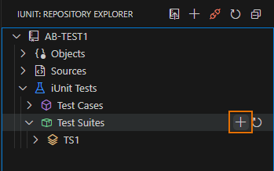  
_Create a Test Suite_

**Step 2**   Set the name of the new Test Suite and press **Enter** to confirm.

<!--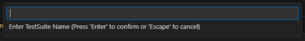-->

**Result**   The Test Suite is created and displayed in the Test Suites Explorer.

## Add a Test Case in Test Suite
Follow the subsequent steps to add a Test Case in a Test Suite.

**Step 1**   Expand the **Test Suites** Node.

**Step 2**   Click the **(+)** icon when hovering the **Test Cases** Node.
   
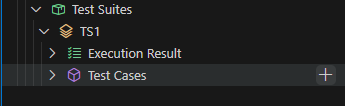  
_Add Test Case_

**Step 3** The list of Test Cases of that repository is displayed. Select the Test Cases you want to add in the Test Suite and press **Enter**.

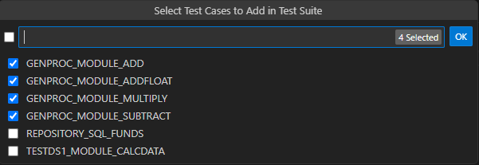  
_Select Test Cases_

**Result**   The Test Cases are successfully added to the Test Suite.

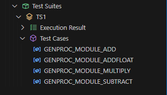  
_Test Cases in the Test Suite_

## Executing Test Suite

Follow the subsequent steps to execute a Test Suite.

**Step 1**   Select a Test Suite and click the **Execution** icon in the **Test Suite** Node.

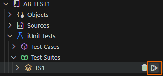  
_Execute a Test Suite_

**Step 2**   The execution confirmation dialog is displayed. Click **OK**.

**Result**   The Test Suite is successfully Executed.

## Understanding the Test Suite Execution Result

When executing a Test Case in a Test Suite, it is the last execution of the Test Case that is presented in the Test Suite **Execution Result** view.
The **Execution Result** Node, when further expanded, displays the Execution Result of that Test Case.

> **Note**  
A green icon indicates a successfully executed Test Case, whereas the red icon signifies a failed one.  

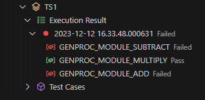  
_Test Case result_

> **Note**  
The execution result of a Test Case is displayed only when the Test Case is executed from the Test Suite.

## Viewing code Coverage Report

From the **Test Suite Result** Node, right-click on a result then click the **Show Code Coverage** option.

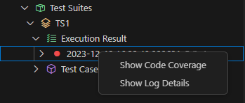  
_Show Code Coverage_

A single code coverage report for all the Test Cases within the Test Suite is displayed in the editor.

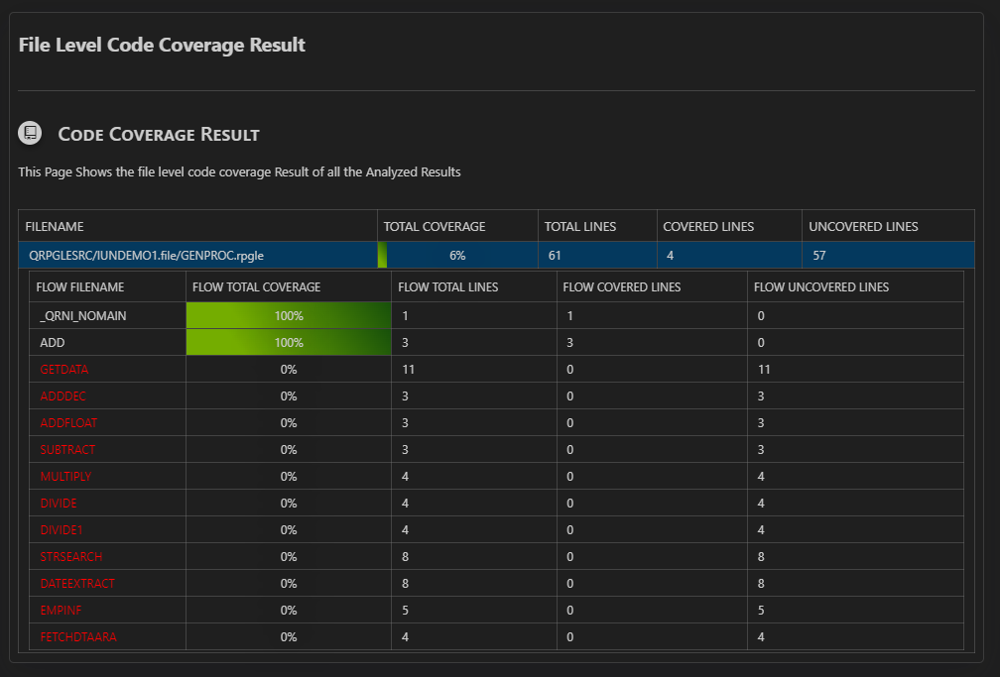  
_Code Coverage Report_

## Deleting Test Cases in Test Suites

Follow the subsequent steps to delete a Test Case in a Test Suite. 

**Step 1**   Hover on the Test Case to delete then click the **Delete** icon.

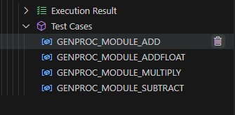  
_Delete Test Cases_

**Step 2**   An warning message is displayed, click **Yes** to confirm the deletion of the Test Case.

<!-- This is repetitive ? 4. Click on the Delete button to delete the Test Case.-->

<!-- 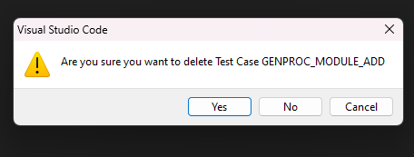-->

**Result**   The Test Case is successfully deleted.

## Deleting Test Suite

**Step 1**   Hover on the Test Suite to delete then click on the **Delete** icon.

  
_Delete Test Suites_

**Step 2**   An warning message is displayed, click **Yes** to confirm the deletion of the Test Suite.

**Result**   The Test Suite is successfully deleted.

<!-- This is repetitive ? 4. Click on the Delete button to delete the Test Suite.-->

<!-- 
## Create a test suite
1. In the Test Suites view, click the  Create Test Suite icon ➕. 

SC

2. Define a Test Suite Name and Press Enter. 

Result : The test suite is created and is displayed in the Test Suites view.

## Add Test Case in Test Suite
1. To add test cases to a test suite, Click on the ➕sign on Hovering the Test Suite Name.

(-sc-)

2. A List of Test Cases of that Repository will Appear. Select the Test Cases You want to add in the Test Suite and press Enter.

(-sc-)

Result : The Test cases are added to the test suite.

(-sc-)

## Delete Test Cases in Test Suite 	
Step 1 :  Right click on the test Case you want to delete.  
Step 2 :  Click delete from the Context menu.  
Result :  Test Case will get Deleted.  

(-sc-)

## Deleting Test Suite
Step 1 :  Right click on the Test Suite  you want to delete.  
Step 2 :  Click delete from the Context menu.  
Result :  Test Suite will be Deleted.  

(-sc-)

## Executing Test Suite
Step 1 : To execute the selected test suite, Click on the Execution Icon on the Test Suite Node.  
Step 2 : The execution confirmation dialog is displayed. Click OK.  
Result : Test Suite Will get Executed.  

(-sc-)

## Understanding the Test Suite Execution Result
When executing a test case in a test suite, it is the last execution of the test case that is presented in the test suite Execution Results view.  
The Execution Result Node when further expanded will show the Execution Result of that Test Suite.  

(-sc-)

When executing a test case in a test suite, it is the last execution of the test case that is presented in the test suite Execution Results view. The test case Execution Results view gives access to the individual result of all the executions of the test case.

(-sc-)

## Viewing code Coverage Report 
On the Test Suite Result Node , Right click to show the context menu then click on “Show Code Coverage”

A single code coverage report for all the test cases within the test suite is displayed in the editor.

(-sc-) -->