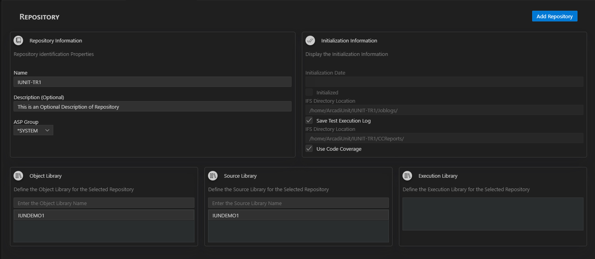
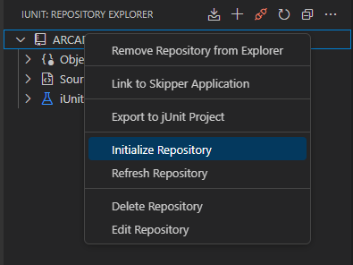

# Repositories

## Create new Repository
1. Click on the (+) icon on the Repository Explorer 
    * Define a Repository Name, 
    * [Optional] Define a Repository Description,
    * Define the ASP Group.
    * Add Libraries to the Repository
    
    
2. Click Add Repository.

Result The repository is created and auto Initialized is displayed in the repository list in the ARCAD iUnit Explorer View

## Edit Repository
You can edit the properties of the repository later like Libraries , Execution log or Code Coverage (if not checked while creating Repository). In the ARCAD iUnit Explorer View, right click on the Repository Node to open in Edit Mode.

## Initializing repositories
Initializing a repository allows you to load all the objects and sources from the libraries defined in the repository. 
When Creating a new Repository the Repository is Auto-initialized, whereas adding a new Library to the Repository requires re-initialization of the Library.

Right Click on Repository to initialize > Click on Initialize option

## Add Repositories to the Explorer
If you've previously added repositories with the same configuration, they will be automatically loaded into the AFS Extension. If not then you can add the repositories to the explorer by following the below steps.

1. Click on the "Add Repository to Explorer " button in the iUnit Extension panel.

2. A Quick Pick with the List of Repositories will pop up listing the Repositories of the connected server , now you can now select the desired repository(s)  you want to work with.

The selected repository will be added to the iUnit Repository Explorer, allowing you to access and manage its Test Cases , Test Suites and other Functionalities.

