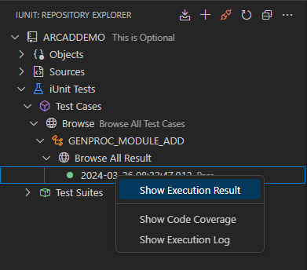
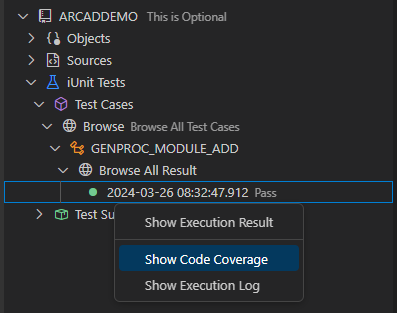

# Test cases

## Create a new Test Case 
ARCAD iUnit simplifies the creation of test cases by retrieving all the procedures and parameters for the parent object targeted by the test case. The test cases can be created manually or by using an existing ARCAD iUnit repository depending on the object details. 

1. In the Test Cases Node, click the (+)  Add Test Case icon

2. Click Select Object from existing iUnit Repository. Click Next > to continue

3. Select the object from the list of objects referenced for the repository. 

The name of the Test Case will be automatically generated based on the selected object and procedure. However, if needed, you can edit the generated name to provide a more descriptive or meaningful identifier for the procedure being Tested.

>note  
Skip Source Parsing Allows you to skip the Parsing of Selected Procedure Source member. This option is useful when the source member is not available on the system.

4. Click Enter.

The Test case will be created and displayed in the Explorer.

## Editing Test Cases
To edit a test case, you can right-click on the test case and select the Edit option as shown below.

### Add Before /After Test Case Execution Command  

1. Enter the command to be executed before or after the test case execution example Enter Command name eg.
`DLTDTAARA DTAARA(QTEMP/TEST)`
2. Click on the Add button to add the command to the list as shown above.

### Add Input Parameters
To add input parameters to a test case, you can click on ADD button as shown below and a dialog will be displayed to add the input parameters.

1. Enter the input parameter name , data type and value.
2. Click on the Add button to add the input parameter to the list as shown above.
3. Click on the Delete button to delete the input parameters.
4. Click on the Edit button to edit the input parameters.
   

## Create Expected Result
Right click on the Test case you want to create the expected Result. Then click on the Create Expected Result button as shown below.

A new window will be displayed to create the expected result.

1. Enter the Expected Parameter Values.
2. Click on the Add button to add the expected parameter.
3. If do not execute is checked, the test case will not be executed.
4. If output same as input is checked, the output parameter will be same as the input parameter.
5. Click on the Save button to save the expected result and if do not execute is not checked, the test case will be executed and result will be shown as below.
   

## Change Expected Result
When working with a test case, expected results may need to be changed.

You can use this option to access the expected result again. Follow the subsequent steps to change the expected result of a test case. 

1. Right-click on a test case and click the **Change Expected Result** option. The Input Parameter Definition dialog opens. 
2. Change the input or output values for the parameters. Click OK. 

The expected result has changed.

## Executing Test Cases 

To execute a test case, you can right-click on the test case and select the Execute option as shown below.

## Understanding Test Results

The Execution Results : The results obtained when Executing the Test case.  

To view the outcome, expand the desired Test Case Node where the execution details will be displayed. A red icon signifies a failed test case, while a green icon indicates a successful pass.  

### Viewing Test Case Execution Result
    
To view the execution result of a test case, you can right-click on the test case and select the **Show Execution Results** option as shown below.

The execution result will be displayed as shown below.

### Viewing Test Case Execution Log

To view the execution log of a test case, you can right-click on the test case and select the Show IBM i logs option as shown below.

The execution log will be displayed as shown below.

## Viewing the Code Coverage Report

Code coverage analysis is the process of finding areas of a program not covered by a set of test cases. You can create additional test cases to increase the coverage.  

Follow the subsequent steps to display the code coverage report for an individual test case.

1. Select a Test case in the Explorer.
2. Expand the Execution Results node.
3. Right click on the Execution Result and select Show Code Coverage Report.

The code coverage report will be displayed as shown below.

