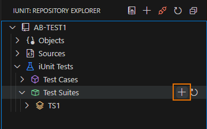
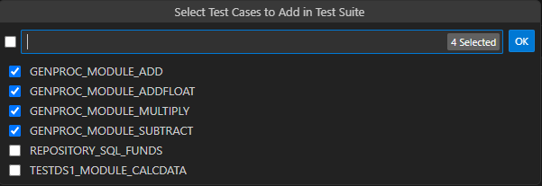
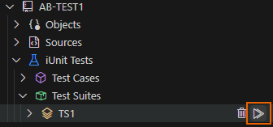
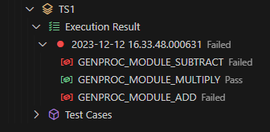
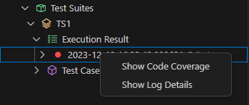
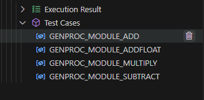
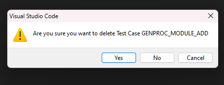
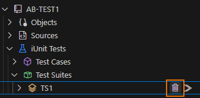

# Test suites
A test suite is a collection of test cases that are grouped together and executed together. A test suite can be executed as a whole or individual test cases can be executed from the test suite.

## Create a test suite
1. In the Test Suites view, click the Create Test Suite icon(+).

    

2. Define a Test Suite Name and Press Enter.

    

3. The test suite is created and is displayed in the Test Suites Explorer.

## Add Test Case in Test Suite
1. To add test cases to a test suite, Expand the Test Suite Node.
2. Click on the + sign on Hovering the Test Cases Node.
   
    

3. A list of Test Cases of that Repository will Appear. Select the Test Cases You want to add in the Test Suite and press Enter.

    

4. The Test cases are added to the test suite.

    

## Executing Test Suite
1. To execute the selected test suite, Click on the Execution Icon on the Test Suite Node.

    

2. The execution confirmation dialog is displayed. Click OK.
3. Test Suite Will get Executed.

   

## Understanding the Test Suite Execution Result
When executing a test case in a test suite, it is the last execution of the test case that is presented in the test suite Execution Results view.
The Execution Result Node when further expanded will show the Execution Result of that Test Cases.
The Red Icon signifies a failed test case, while a Green Icon indicates a successful pass.

 `Note: The execution result of a test case is displayed only when the test case is executed from the test suite.`

## Viewing code Coverage Report
1. On the Test Suite Result Node, Right click to show the context menu then click on “Show Code Coverage”.

    

2. A single code coverage report for all the test cases within the test suite is displayed in the editor.
3. The code coverage report is displayed as shown below.

    

## Delete Test Cases in Test Suite

1. Hover on the test Case you want to delete.
2. Click delete icon from the Test Case.

    

3. A window will pop up to confirm the deletion of the Test Case.

    

4. Click on the Delete button to delete the Test Case.

5. Test Case will get Deleted.

## Deleting Test Suite

1. Hover on the Test Suite  you want to delete.
2. Click on the delete icon from the Test Suite.

    

3. A window will pop up to confirm the deletion of the Test Suite.
4. Click on the Delete button to delete the Test Suite.
   

<!-- 
## Create a test suite
1. In the Test Suites view, click the  Create Test Suite icon ➕. 

SC

2. Define a Test Suite Name and Press Enter. 

Result : The test suite is created and is displayed in the Test Suites view.

## Add Test Case in Test Suite
1. To add test cases to a test suite, Click on the ➕sign on Hovering the Test Suite Name.

(-sc-)

2. A List of Test Cases of that Repository will Appear. Select the Test Cases You want to add in the Test Suite and press Enter.

(-sc-)

Result : The Test cases are added to the test suite.

(-sc-)

## Delete Test Cases in Test Suite 	
Step 1 :  Right click on the test Case you want to delete.  
Step 2 :  Click delete from the Context menu.  
Result :  Test Case will get Deleted.  

(-sc-)

## Deleting Test Suite
Step 1 :  Right click on the Test Suite  you want to delete.  
Step 2 :  Click delete from the Context menu.  
Result :  Test Suite will be Deleted.  

(-sc-)

## Executing Test Suite
Step 1 : To execute the selected test suite, Click on the Execution Icon on the Test Suite Node.  
Step 2 : The execution confirmation dialog is displayed. Click OK.  
Result : Test Suite Will get Executed.  

(-sc-)

## Understanding the Test Suite Execution Result
When executing a test case in a test suite, it is the last execution of the test case that is presented in the test suite Execution Results view.  
The Execution Result Node when further expanded will show the Execution Result of that Test Suite.  

(-sc-)

When executing a test case in a test suite, it is the last execution of the test case that is presented in the test suite Execution Results view. The test case Execution Results view gives access to the individual result of all the executions of the test case.

(-sc-)

## Viewing code Coverage Report 
On the Test Suite Result Node , Right click to show the context menu then click on “Show Code Coverage”

A single code coverage report for all the test cases within the test suite is displayed in the editor.

(-sc-) -->

