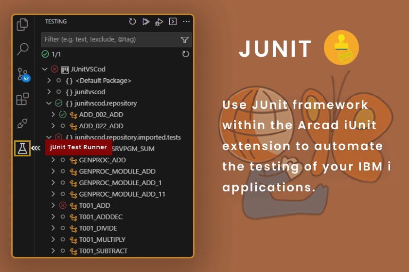
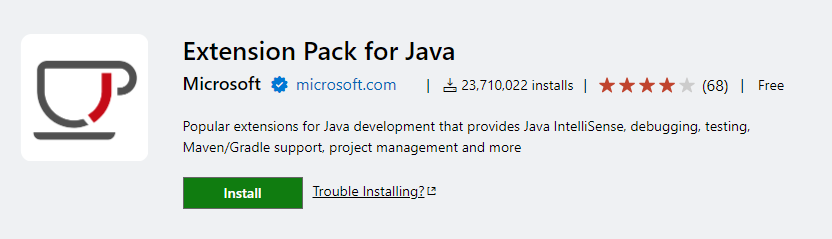
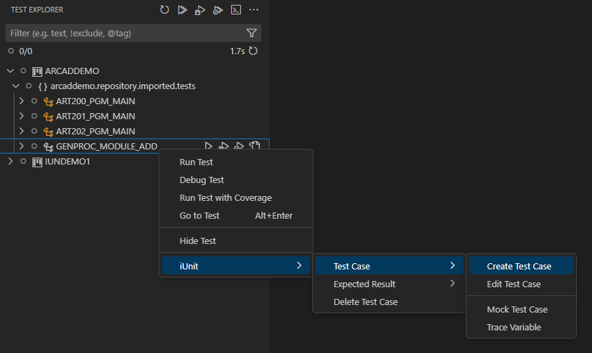
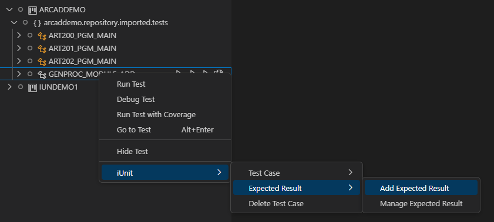
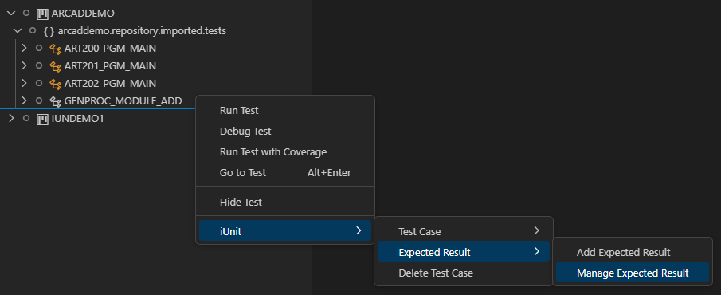
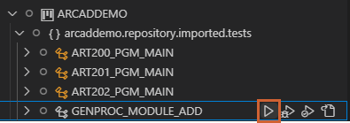
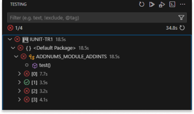
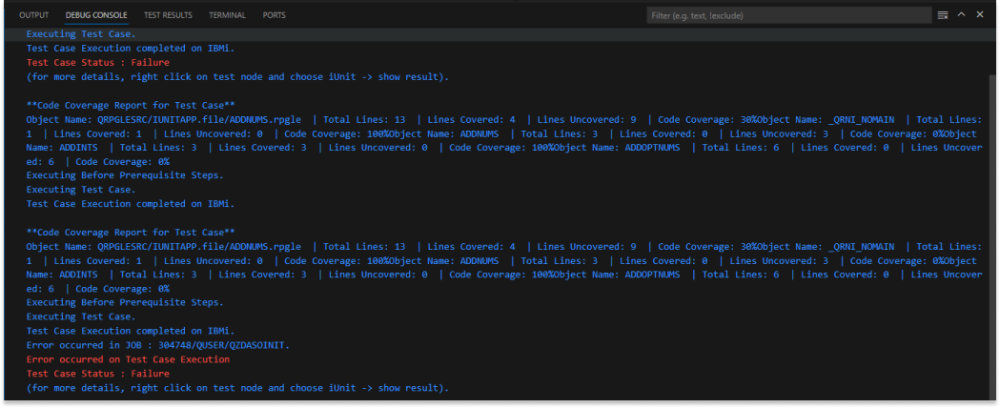

# Setting up the JUnit testing environment 
In order to execute unit-tests on your applications via JUnit, you must first set up the testing
environment. This involves creating projects and managing repositories and versions.

ARCAD-iUnit projects are used to create and run unit test cases via JUnit.

## Prerequisites
Prior knowledge of JUnit testing methods and vocabulary. This documentation does not cover JUnit
technology.

[Extension Pack for Java](https://marketplace.visualstudio.com/items?itemName=vscjava.vscode-java-pack) must be installed in your VS Code IDE to use the JUnit testing features.

## Importing the ARCAD-iUnit project

**Note:** : To Run the jUnit-iUnit Project You have to Manually Import the iUnit Project to the Workspace.

To import the ARCAD-iUnit project, follow these steps:

1. Right-click on the repository and select "Export to ARCAD-iUnit Project" from the ARCAD-iUnit Extension.
2. The ARCAD-iUnit project will be created with the same name as the repository.
3. The project will be added to the current workspace in the VS Code IDE.
4. The jUnit Extension will automatically detect the ARCAD-iUnit project and display the test cases in the Test Explorer.
5. You can execute the test cases directly from the Test Explorer.
6. The test results will be shown in the Test Results window.

## Creating the Test Case in jUnit

**Note:** You can access the Arcad Iunit Menu only when you are connected to the AFS server using the Arcad Iunit Extension or Use Command Palette ` ctrl+shift+p ` and type **Connect to AFS Server** and Continue with the steps to connect.

In jUnit Mode you can create a new jUnit Test Case by right clicking on the Test Explorer and selecting the option Create Test Case from the Context Menu as shown below.

## Add the Expected Result to the Test Case

The Expected Result can be added to the Test Case by right clicking on the Test Case and selecting the option Add Expected Result from the Context Menu as shown below.

You can also add multiple Expected Results to the Test Case by right clicking on the Test Case and selecting the option Add Expected Result from the Context Menu as shown below.

## Manage Multiple Expected Results

You can manage multiple Expected Results by right clicking on the Test Case and selecting the option Manage Expected Results from the Context Menu and a winodw will be displayed with the list of Expected Results and you can choose one to Modify the Expected Result.

## Executing the Test Case

The Test Case in jUnit Mode can be Executed by clicking on the Execute Test Case icon on the Test Case in Test Explorer. You can Also Execute Multiple Test Cases By Executing the desired Package of Test Cases or the Entire Project.

## View the Test Results

The Test Case Pass Fail Can be viewed on the Test Explorer.

>note  
The Test Results can be viewed on the Test Results Window. The Test Results Window can be opened by clicking on the Test Results icon on the Status Bar.

## View the Code Coverage

The Code Coverage of the Test Case can be viewed on the Debug Console.

